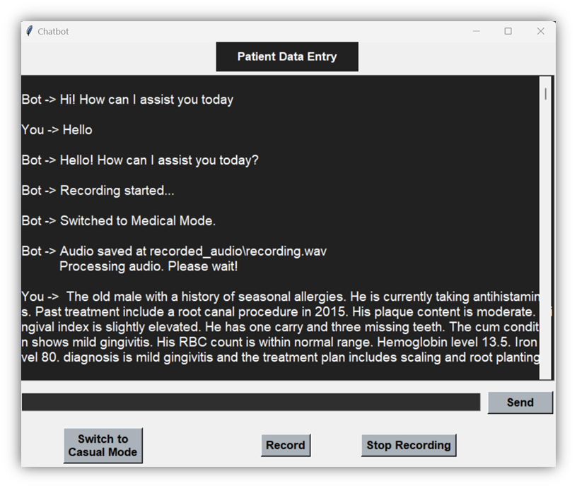
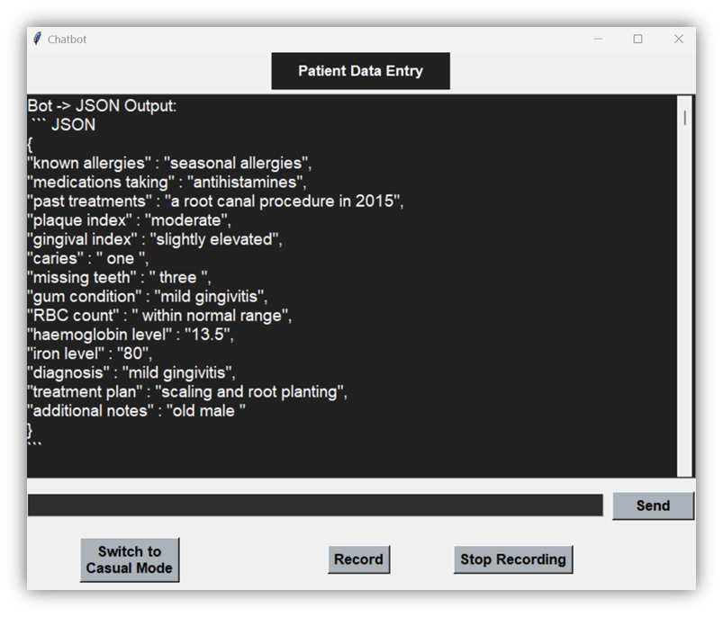
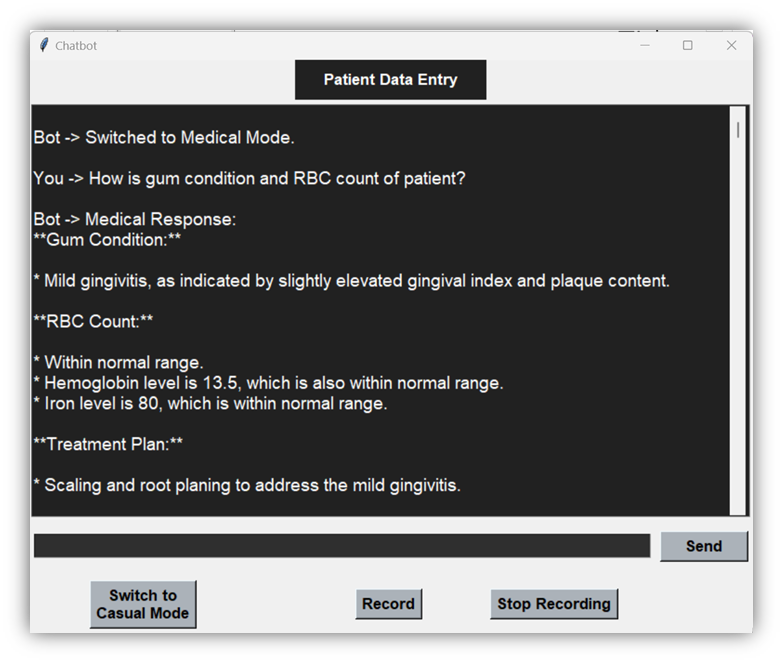
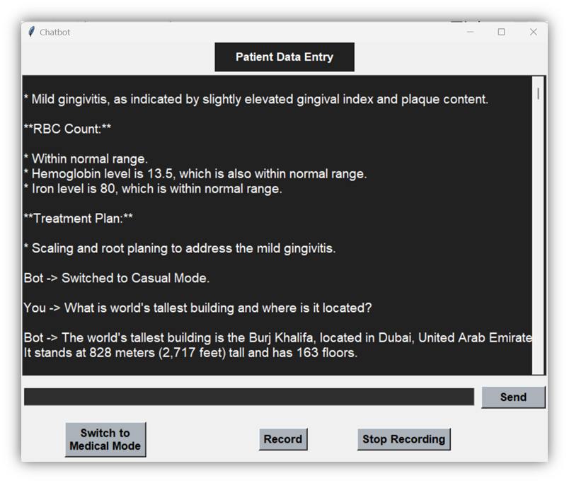

# 🩺 Voice-Based Medical Logger and Chatbot

Efficient Medical Data Entry with Speech-to-Text and an Interactive Chatbot for Doctors.

This application is designed to streamline patient data documentation using voice input and AI-powered chatbot interactions. Built with Python's Tkinter for GUI, Whisper for speech-to-text, and Gemini API for intelligent medical data extraction, it helps doctors record and retrieve patient information quickly and efficiently.

---

## 🚀 Overview and Purpose

In the healthcare domain, efficient and accurate documentation is critical. This tool enables doctors to:

- Enter patient data using **voice commands**.
- Interact with a **smart chatbot** that understands both medical and casual contexts.
- Automatically extract and structure patient information via the **Gemini API** for better storage and access.

---

## ✨ Features

### 🎤 1. Speech-to-Text Conversion
- Start/Stop voice recording using buttons in the GUI.
- Converts dictated medical information to text using **Whisper-large-v3**.
- Text is displayed in the chatbot interface for confirmation/editing.
### 🎤 1. Speech-to-Text Conversion

---

### 🤖 2. Dual Chatbot Modes (Medical & Casual)
- **Medical Mode**: Ask patient-specific queries like previous diagnoses, prescriptions, or vitals.
- **Casual Mode**: Ask general questions like "Hi", "How are you?" for more relaxed interactions.
- Switch modes dynamically using the GUI.

  
_Fig: Initial Welcome Page – Casual Mode (default)_

  
_Fig: Chat box to send message and interact with Bot_

  
_Fig: Bot response in Casual Mode_

  
_Fig: Switched to Medical Mode_

  
_Fig: Switched to Casual Mode_

---

### 🧠 3. Integration with Gemini API
- Processes transcribed speech and extracts **medical keywords**.
- Converts the text to a **structured JSON format** for storing in a database.
- Ensures reliable querying and chatbot responses in Medical Mode.

  
_Fig: Extracted and saved patient information_

---

## ✅ Benefits

- ⏱️ **Efficiency**: Doctors save time by dictating rather than typing.
- 🩹 **Accuracy**: Structured formats reduce data entry mistakes.
- 🔁 **Flexibility**: Mode switching adapts to context (medical vs. casual).

---

## 🧰 Tech Stack

| Area                | Technology Used                         |
|---------------------|------------------------------------------|
| GUI                 | Python Tkinter                           |
| Speech Recognition  | Hugging Face `whisper-large-v3`         |
| AI Chatbot          | Gemini Pro API (Google Generative AI)   |
| Data Structuring    | JSON-based format extraction             |
| Backend/Logic       | Python                                   |

---
